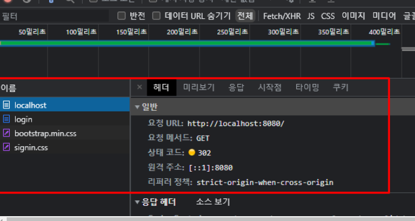

# Photogram

<details>
<summary>회원가입</summary>

### 시큐리티 세팅

```xml
	<dependency>
			<groupId>org.springframework.boot</groupId>
			<artifactId>spring-boot-starter-security</artifactId>
		</dependency>
```

- 클라이언트가 서버에 요청하면 /login 으로 redirect 된다.



### 시큐리티 커스텀 하기

```java
@EnableWebSecurity
@Configuration // IOC
public class SecurityConfig extends WebSecurityConfigurerAdapter {
}

```

- WebSecurityConfigureAdapter 를 상속받으면 시큐리티 설정파일로 인식이 된다.
- @Configuration 으로 해당 클래스를 IoC 컨테이너에 등록
- @EnableWebSecurity 로 시큐리티 설정파일로 인식된 파일을 활성화 시킴

```java
@EnableWebSecurity
@Configuration // IOC
public class SecurityConfig extends WebSecurityConfigurerAdapter {
    @Override
    protected void configure(HttpSecurity http) throws Exception {
        http.authorizeRequests()
                .antMatchers("/","/user/**","/image/**","/subscribe/**","/comment/**,/api/**") // 다음과 같은 URL은..
                .authenticated() // 인증이 필요합니다.
                .anyRequest() // 그 외의 URL은..
                .permitAll() // 허용 해주겠습니다.
                .and()
                .formLogin() // 인증이 필요한 URL은
                .loginPage("/auth/signin") // 로그인 창으로 리다이렉션 해주고 URL은 다음과 같다.
                .loginProcessingUrl("/auth/signin")// post
                .defaultSuccessUrl("/"); // 로그인에 성공하면 다음 URL로 이동
    }
}
```

- HttpSecurity http 의 authorizeRequests() 메서드
- .andMatchers() : 요청이 들어오는 경로 지정
- .authenticated() : 해당 경로로 들어온 요청은 인증이 필요하다고 지정
- .anyRequest() : 인증이 필요하지 않는 모든 요청
- .permitAll() : 모두 허용함
- .and() : 그리고
- .formLogin() : 로그인이 필요한 요청
- .loginPage() : 해당 URL에서 로그인 요청 처리
- .defaultSuccessUrl() :  로그인 응답 후 이동할 페이지 

</details>
